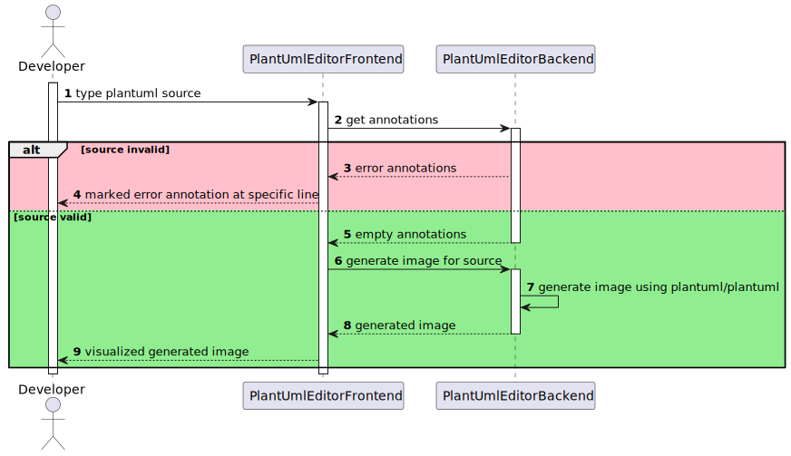

# PlantUML Editor


* [How does it work?](#how-does-it-work)  
* [Screenshot](#screenshot)
* [Demo](#demo)
* [Basic usage](#basic-usage)
    * [run with docker](#run-with-docker)
    * [run with docker-compose](#run-with-docker-compose) 
* [Customized usage](#customized-usage)
    * [Frontend config](#frontend-config)
        * [Share links](#share-links)
        * [Footer actions](#footer-actions)
        * [Icons](#icons)
    * [run with docker](#run-with-docker-1)
    * [run with docker-compose](#run-with-docker-compose-1) 
        * [With sharing disabled](#with-sharing-disabled)
        * [With sharing enabled using WebDAV](#with-sharing-enabled-using-webdav)
        * [With sharing enabled using Redis](#with-sharing-enabled-using-redis)

Backend and frontend for a [PlantUML](https://plantuml.com/de/) editor web application
* The backend generates images from [PlantUML](https://plantuml.com/de/) using [plantuml/plantuml](https://github.com/plantuml/plantuml). It also provides annotations in case of invalid source.
* The fully responsive frontend allows you to see the generated images as you type and also highlights syntax errors linewise

## How does it work?

<details>
  <summary>PlantUML source for this diagram</summary>
  
  ```
@startuml

autonumber

actor Developer
participant PlantUmlEditorFrontend
participant PlantUmlEditorBackend

activate Developer
Developer -> PlantUmlEditorFrontend: type plantuml source

activate PlantUmlEditorFrontend
PlantUmlEditorFrontend -> PlantUmlEditorBackend: get annotations

activate PlantUmlEditorBackend

alt #pink source invalid
    PlantUmlEditorBackend --> PlantUmlEditorFrontend: error annotations
    PlantUmlEditorFrontend --> Developer: marked error annotation at specific line
else #lightgreen source valid
    PlantUmlEditorBackend --> PlantUmlEditorFrontend: empty annotations
    deactivate PlantUmlEditorBackend
    PlantUmlEditorFrontend -> PlantUmlEditorBackend: generate image for source
    activate PlantUmlEditorBackend
    PlantUmlEditorBackend -> PlantUmlEditorBackend: generate image using plantuml/plantuml
    PlantUmlEditorBackend --> PlantUmlEditorFrontend: generated image
    deactivate PlantUmlEditorBackend
    PlantUmlEditorFrontend --> Developer: visualized generated image
end

deactivate PlantUmlEditorFrontend
deactivate Developer

@enduml
  ```

</details>

### Screenshot


## Demo
A running demo is available at https://plantuml.mseiche.de/.

## Basic usage
### run with docker
```shell
docker run -d -p 80:80 --name plantuml-editor hakenadu/plantuml-editor
```

### run with docker-compose
```yaml
plantuml-editor:
  image: hakenadu/plantuml-editor
  container_name: plantuml-editor
  ports:
  - "80:8080"
```

## Customized usage
You may customize parts of the application by providing config options.

### Backend Config
The backend is configured using environment variables.

### Frontend config

#### Example for plantuml.mseiche.de
For the app published at https://plantuml.mseiche.de/ I'm using the following *frontend-config.json*

```json
{ 
   "share": {
      "description": "<p>Your PlantUML spec will be stored symmetrically encrypted via <a href=\"https:\/\/en.wikipedia.org\/wiki\/WebDAV\">WebDAV<\/a>.<\/p><p>The information needed to decrypt the stored data is the id which is sent by your browser when accessing the data.<\/p><p class=\"mb-0\">Anyhow if you use this functionality you agree to my <a href=\"https:\/\/mseiche.de\/terms-of-service\">Terms of Service<\/a><\/p>"
   },
   "footer": {
      "actions": [
         {
            "type": "popup",
            "icon": {
               "type": "material",
               "name": "privacy_tip"
            },
            "content": "<div>This page belongs to <a href=\"https:\/\/mseiche.de\" target=\"_blank\">mseiche.de<\/a> therefore the following documents also apply for this page:<ul class=\"mb-0\"><li><a href=\"https:\/\/mseiche.de\/privacy-policy\" target=\"_blank\">Privacy Policy<\/a><\/li><li><a href=\"https:\/\/mseiche.de\/terms-of-service\" target=\"_blank\">Terms of Service<\/a><\/li><li><a href=\"https:\/\/mseiche.de\/about\" target=\"_blank\">About<\/a><\/li><\/ul><\/div>",
            "tooltip": "Privacy and Terms of Service"
         },
         {
            "type": "link",
            "icon": {
               "type": "img",
               "src": "assets/images/github.svg",
               "width": "28",
               "height": "28"
            },
            "href": "https://github.com/Hakenadu/plantuml-editor",
            "tooltip": "View the code for this page on GitHub"
         },
         {
            "type": "link",
            "icon": {
               "type": "img",
               "src": "assets/images/mseiche.svg",
               "width": "28",
               "height": "28"
            },
            "href": "https://mseiche.de",
            "tooltip": "Visit my main page"
         }
      ]
   }
}
```

#### Maximal Example
```json
{
   "intro": {
      "description": "<h1>Hi there</h1><p>This is the content which will be shown if the editor is empty</p>",
      "slideshow": {
         "showMessage": true,
         "visible": true
      }
   },
   "share": {
        "description": "<p>Your PlantUML spec will be stored symmetrically encrypted via <a href=\"https:\/\/en.wikipedia.org\/wiki\/WebDAV\">WebDAV<\/a>.<\/p><p>The information needed to decrypt the stored data is the id which is sent by your browser when accessing the data.<\/p><p class=\"mb-0\">Anyhow if you use this functionality you agree to my <a href=\"https:\/\/mseiche.de\/terms-of-service\">Terms of Service<\/a><\/p>"
   },
   "footer": {
      "actions": [
         {
            "type": "popup",
            "icon": {
               "type": "material",
               "name": "privacy_tip"
            },
            "content": "<div>This page belongs to <a href=\"https:\/\/mseiche.de\" target=\"_blank\">mseiche.de<\/a> therefore the following documents also apply for this page:<ul class=\"mb-0\"><li><a href=\"https:\/\/mseiche.de\/privacy-policy\" target=\"_blank\">Privacy Policy<\/a><\/li><li><a href=\"https:\/\/mseiche.de\/terms-of-service\" target=\"_blank\">Terms of Service<\/a><\/li><li><a href=\"https:\/\/mseiche.de\/about\" target=\"_blank\">About<\/a><\/li><\/ul><\/div>",
            "tooltip": "Privacy and Terms of Service"
         },
         {
            "type": "link",
            "icon": {
               "type": "img",
               "src": "assets/images/github.svg",
               "width": "28",
               "height": "28"
            },
            "href": "https://github.com/Hakenadu/plantuml-editor",
            "tooltip": "View the code for this page on GitHub"
         },
         {
            "type": "link",
            "icon": {
               "type": "img",
               "src": "assets/images/mseiche.svg",
               "width": "28",
               "height": "28"
            },
            "href": "https://mseiche.de",
            "tooltip": "Visit my main page"
         }
      ]
   }
}
```

#### Share Links
If share links are enabled you need to provide the "share" configuration entry to make the share button appear.
You may provide a custom description for the share dialog using the share.description configuration entry.
This can especially be useful, if you need to link custom terms of service.

#### Footer actions
The following types of actions are supported:
* *popup* contains a custom html template which will be shown in a popup menu after clicking the generated action button
* *link* opens a provided link in a new tab after clicking the generated action button

each action can be parameterized with the following attributes:
* *tooltip* (optional) contains a text which will be shown while hovering the generated action button
* *icon* controls the appearance of the generated action button

#### Icons
Currently two types of icons are supported:
* *material* shows a [google material icon](https://fonts.google.com/icons) by its name
* *img* shows an image using an img tag and a resource uri

### run with docker
```shell
docker run -d -p 80:8080 --name plantuml-editor -v /path/to/your/frontend-config.json:/opt/config/frontend-config.json hakenadu/plantuml-editor
```

### run with docker-compose

#### With sharing disabled
```yaml
plantuml-editor:
   image: hakenadu/plantuml-editor
   container_name: plantuml-editor
   ports:
   - 80:8080
   volumes:
   - /path/to/your/frontend-config.json:/opt/config/frontend-config.json
```

#### With sharing enabled using WebDAV
For enabling share links you may provide a WebDAV interface for the plantuml-editor.
The following docker-compose example shows a maximal example.

```yaml
version: '3'
services:
  plantuml-editor:
    image: hakenadu/plantuml-editor
    container_name: plantuml-editor
    environment:
      # MANDATORY VARIABLES
      SPRING_PROFILES_ACTIVE: webdav # activate the /documents endpoint using webdav
      WEBDAV_URL: http://plantuml-editor-webdav:80 # url to the webdav interface
      WEBDAV_USERNAME: john # basic auth webdav username
      WEBDAV_PASSWORD: doe1337 # basic auth webdav password
      # OPTIONAL VARIABLES
      DOCUMENT_SALT: my-fancy-at-least-8-bytes-long-salt # salt for symmetrically encrypting document content
      DOCUMENT_LIFETIME: PT168H # the maximum age for stored documents (defaults to 7 days)
      DOCUMENT_REAPER_CRON: '0 0/10 * * * ?' # the cron definition which determines the frequency for the document reaper to delete old documents (defaults to 10 minutes)
      WEBDAV_COLLECTION: # if passed, an existing webdav collection will be used
    ports:
    - 80:8080
    build:
      context: ./
  plantuml-editor-webdav:
    image: bytemark/webdav
    container_name: plantuml-editor-webdav
    environment:
      USERNAME: john # basic auth webdav username
      PASSWORD: doe1337 # basic auth webdav password
```

#### With sharing enabled using Redis
For enabling share links you may also provide a Redis interface for the plantuml-editor.
The following docker-compose example shows a maximal example.

```yaml
version: '3'
services:
  plantuml-editor:
    image: hakenadu/plantuml-editor
    container_name: plantuml-editor
    environment:
      # MANDATORY VARIABLES
      SPRING_PROFILES_ACTIVE: redis
      REDIS_HOST: plantuml-editor-redis
      REDIS_PASSWORD: doe1337 # use a better one ;-)
      # OPTIONAL VARIABLES
      REDIS_PORT: 6379
      REDIS_PREFIX: /documents/ # prefix for persisted values
      DOCUMENT_SALT: my-fancy-at-least-8-bytes-long-salt # salt for symmetrically encrypting document content
      DOCUMENT_LIFETIME: PT168H # the maximum age for stored documents (defaults to 7 days)
    ports:
    - 80:8080
    build:
      context: ./
  plantuml-editor-redis:
    image: bitnami/redis # or registry.redhat.io/rhel8/redis-5:1-144
    container_name: plantuml-editor-redis
    environment:
      REDIS_PASSWORD: doe1337 # use a better one ;-)
```
